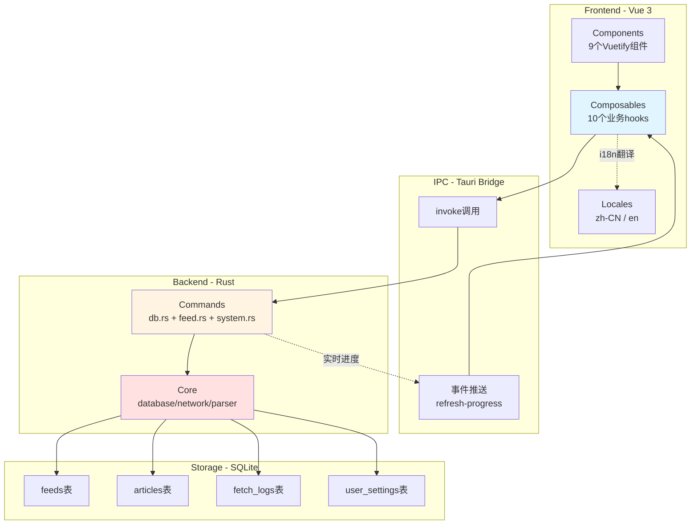

# 架构设计

## 系统架构



## 模块职责

### Frontend (Vue 3)
- **Components**: UI 展示，用户交互
- **Composables**: 业务逻辑封装，IPC 调用（含 useI18n 国际化管理）
- **Locales**: 翻译文件（zh-CN、en），8 个命名空间
- **State**: 使用 `ref()` 响应式状态（无 Vuex/Pinia）

### Backend (Rust)
- **Commands**: IPC handlers，参数验证，错误转换（db.rs + feed.rs + system.rs）
- **Core**: 核心业务逻辑
  - `database.rs`: SQLite 操作（4 个表）
  - `network.rs`: HTTP 客户端（15s 超时，3 次重试）
  - `parser.rs`: RSS/Atom 解析
  - `error.rs`: 统一错误类型 + i18n 错误码

### IPC 通信
- **正向**: Frontend `invoke()` → Rust Command → Core Module
- **反向**: Rust `app.emit()` → Frontend `listen()`

## 数据流

### 添加 Feed 流程
```
用户输入 URL
  ↓
useFeeds.addFeed()
  ↓
invoke('add_feed')
  ↓
network::fetch_feed()      // HTTP GET
  ↓
parser::parse_feed()       // 解析 RSS/Atom
  ↓
database::db_insert_feed() // INSERT
  ↓
database::db_insert_articles() // 批量插入
  ↓
返回 Feed 对象
```

### 批量刷新流程
```
用户点击"全部刷新"
  ↓
invoke('batch_refresh_feeds')
  ↓
for each feed:
  ├─ 拉取 Feed
  ├─ 解析文章
  ├─ 插入新文章
  └─ emit('refresh-progress') // 实时进度
  ↓
返回汇总结果
```

## Plugin 使用

| Plugin | 用途 | 权限 |
|--------|------|------|
| `tauri-plugin-shell` | 打开外部链接 | `shell:allow-open` |
| `tauri-plugin-dialog` | 文件对话框 | `dialog:allow-open/save` |
| `tauri-plugin-fs` | 文件读写 | `fs:allow-read/write-file` |

配置: `src-tauri/capabilities/default.json`

## 国际化 (i18n)

### 架构
- **前端**: vue-i18n (v10)，支持中文 (zh-CN) 和英文 (en)
- **后端**: sys-locale (v0.3) 检测系统语言，user_settings 表持久化语言偏好
- **错误国际化**: Rust 后端返回错误码（如 `errors.network`），前端根据错误码翻译

### 数据流
```
App.vue onMounted
  ↓ invoke('init_db')
  ↓ useI18n.init()
  ↓ invoke('get_user_setting', { key: 'language' })
  ├─ 值为 'system' 或 null → invoke('get_system_locale') → 检测系统语言
  ├─ 值为 'zh-CN' 或 'en' → 直接使用
  └─ 无效值 → 回退到系统语言
  ↓ locale.value = resolvedLocale
```

### 后端实现

#### 系统语言检测 (`commands/system.rs`)
```rust
#[tauri::command]
pub fn get_system_locale() -> String {
    sys_locale::get_locale().unwrap_or_else(|| "zh-CN".to_string())
}
```

#### 错误码机制 (`core/error.rs`)
```rust
impl AppError {
    pub fn code(&self) -> &'static str {
        match self {
            AppError::NetworkError(_) => "errors.network",
            AppError::ParseError(_) => "errors.parse",
            AppError::DatabaseError(_) => "errors.database",
            AppError::ValidationError(_) => "errors.validation",
            AppError::JsonError(_) => "errors.json",
            AppError::IoError(_) => "errors.io",
        }
    }
}
```

#### user_settings 表
```sql
CREATE TABLE IF NOT EXISTS user_settings (
    key TEXT PRIMARY KEY NOT NULL,
    value TEXT NOT NULL,
    updated_at INTEGER NOT NULL DEFAULT (strftime('%s', 'now'))
)
```

### 前端实现

#### 文件结构
- `src/i18n.ts`: vue-i18n 配置（legacy: false, fallback: zh-CN）
- `src/locales/zh-CN.ts`: 中文翻译（8 个命名空间）
- `src/locales/en.ts`: 英文翻译（8 个命名空间）
- `src/composables/useI18n.ts`: i18n 组合式函数

#### 翻译命名空间
| 命名空间 | 用途 |
|----------|------|
| `common` | 通用按钮和操作 |
| `settings` | 设置页面 |
| `articles` | 文章列表 |
| `feeds` | Feed 管理 |
| `categories` | 分类 |
| `refresh` | 刷新操作 |
| `errors` | 错误消息 |
| `theme` / `toast` / `about` | 主题、提示、版本 |

#### 使用方式
```typescript
// 在组件中使用
import { useI18n } from '@/composables/useI18n'
const { t, locale, setLocale } = useI18n()

// 模板中使用
{{ t('settings.title') }} 或 {{ $t('settings.title') }}

// 设置语言（持久化到数据库）
await setLocale('en') // 'zh-CN' | 'en' | 'system'
```
