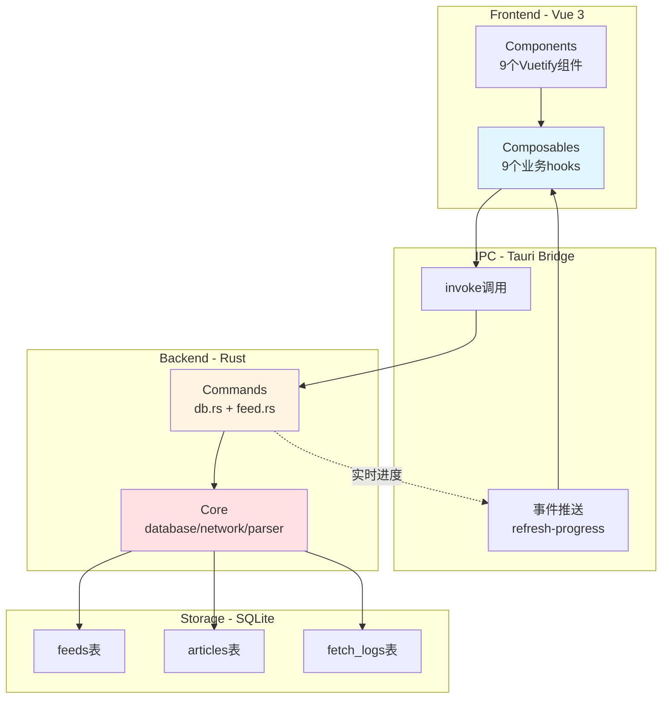

# 架构设计

## 系统架构



## 模块职责

### Frontend (Vue 3)
- **Components**: UI 展示，用户交互
- **Composables**: 业务逻辑封装，IPC 调用
- **State**: 使用 `ref()` 响应式状态（无 Vuex/Pinia）

### Backend (Rust)
- **Commands**: IPC handlers，参数验证，错误转换
- **Core**: 核心业务逻辑
  - `database.rs`: SQLite 操作
  - `network.rs`: HTTP 客户端（15s 超时，3 次重试）
  - `parser.rs`: RSS/Atom 解析

### IPC 通信
- **正向**: Frontend `invoke()` → Rust Command → Core Module
- **反向**: Rust `app.emit()` → Frontend `listen()`

## 数据流

### 添加 Feed 流程
```
用户输入 URL
  ↓
useFeeds.addFeed()
  ↓
invoke('add_feed')
  ↓
network::fetch_feed()      // HTTP GET
  ↓
parser::parse_feed()       // 解析 RSS/Atom
  ↓
database::db_insert_feed() // INSERT
  ↓
database::db_insert_articles() // 批量插入
  ↓
返回 Feed 对象
```

### 批量刷新流程
```
用户点击"全部刷新"
  ↓
invoke('batch_refresh_feeds')
  ↓
for each feed:
  ├─ 拉取 Feed
  ├─ 解析文章
  ├─ 插入新文章
  └─ emit('refresh-progress') // 实时进度
  ↓
返回汇总结果
```

## Plugin 使用

| Plugin | 用途 | 权限 |
|--------|------|------|
| `tauri-plugin-shell` | 打开外部链接 | `shell:allow-open` |
| `tauri-plugin-dialog` | 文件对话框 | `dialog:allow-open/save` |
| `tauri-plugin-fs` | 文件读写 | `fs:allow-read/write-file` |

配置: `src-tauri/capabilities/default.json`

## 国际化 (i18n)

### 架构
- 使用 vue-i18n 进行前端国际化
- 支持中文和英文双语
- 语言设置存储在 `user_settings` 表中
- Rust 后端返回错误码，前端根据错误码翻译

### 数据流
1. 应用启动时，从数据库读取语言设置
2. 如果不存在，检测系统语言
3. 用户可以在设置中手动切换语言
4. 语言设置持久化到数据库

### 翻译文件
- `src/locales/zh-CN.ts`: 中文翻译
- `src/locales/en.ts`: 英文翻译
- `src/i18n.ts`: i18n 配置
- `src/composables/useI18n.ts`: i18n 组合式函数

### 使用方式
```typescript
// 在组件中使用
import { useI18n } from '@/composables/useI18n'
const { t, locale, setLocale } = useI18n()

// 模板中使用
{{ $t('settings.title') }}

// 设置语言
await setLocale('en') // 'zh-CN' | 'en' | 'system'
```
