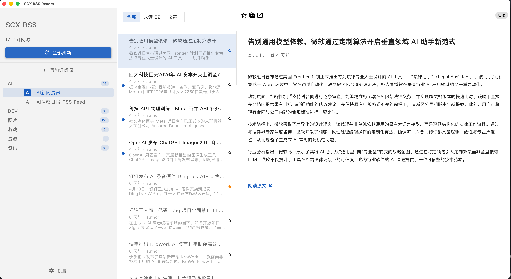
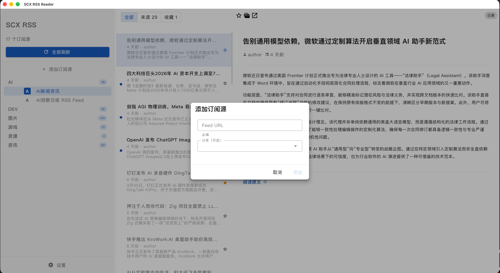
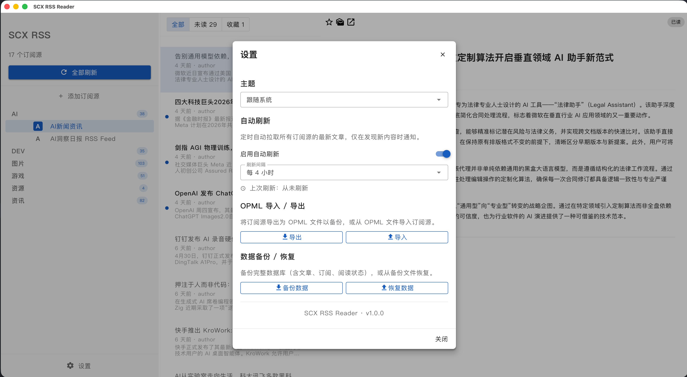
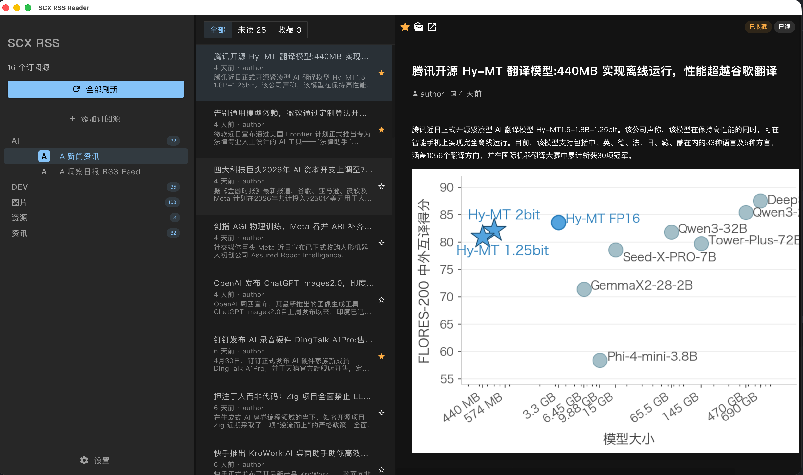

# SCX RSS Reader

基于 Tauri v2 (Rust) + Vue 3 + Vuetify 3 的本地优先桌面 RSS 阅读器。单用户，无需服务端。

## 预览











## 功能

- RSS/Atom 订阅源拉取与解析
- 文章阅读、已读/收藏管理
- 分类管理
- 批量刷新与进度显示
- 自动刷新（定时静默拉取）
- OPML 导入/导出
- 数据库备份/恢复
- 三套主题（Material Light / Material Dark / Warm Ink）
- 键盘快捷键（j/k 导航、r 已读、s 收藏）

## 开发

```bash
pnpm install          # 安装依赖
pnpm tauri dev        # 开发模式
pnpm tauri build      # 生产构建

cd src-tauri
cargo fmt             # 格式化 Rust
cargo clippy          # 检查 Rust
cargo test            # 测试 Rust
```

## 技术栈

| 层级 | 技术 |
|------|------|
| 桌面框架 | Tauri v2 |
| 前端 | Vue 3 + Vuetify 3 + TypeScript |
| 后端 | Rust |
| 数据库 | SQLite (rusqlite) |

## 项目文档

- [架构设计](.wiki/Architecture.md)
- [开发指南](.wiki/Development.md)
- [任务清单](TODO.md)

## 许可证

MIT
